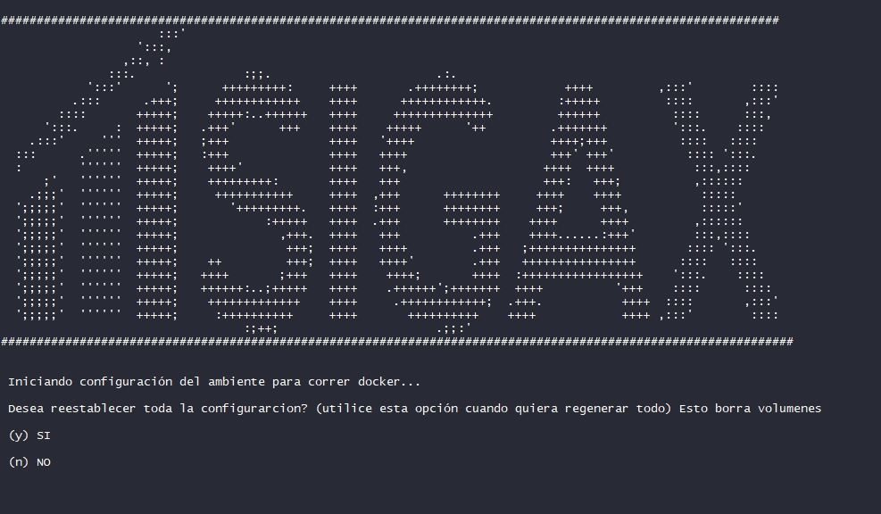

.. Título

Guía de Instalación de SIGAX
======================================

La Instalación de SIGAX implica ejecutar la aplicación en un ambiente definido por los archivos fuentes del proyecto. Además de esto es necesario preparar la base de datos para que sea posible utilizar una configuracion multi esquema. La idea con esta guía es que la instalación del proyecto sea un proceso fácil de realizar y que no implique muchos pasos.

Todas estas tareas se programaron y sólo es necesario ejecutar una serie de archivos. Sin embargo se explicará cada archivo para que se tenga una idea general de cómo funcionan. Si desea profundizar debe ir al código.

SIGAX corre bajo python 3.6 con django 1.11 y postgres 9.6. Es importante tener en cuenta las versiones porque son cruciales para el usuo de schemas en el desarrollo del software como servicio.

====================
Clonar el proyecto
====================

Si tiene acceso al repositorio de SIGAX sólo debe clonar el repo a su computador. Si aún no tiene acceso debe solicitarlo. Ir a SIGAX en GitHub `a link`_.

.. _a link: https://github.com/jhonsfran1165/sigax

.. note::

    Recuerda que este repositorio es privado.

.. code-block::
   python
   :linenos:

   git clone https://github.com/jhonsfran1165/sigax.git

====================
Tipos de instalación
====================

Una vez clonado el proyecto se encontrara con el siguiente árbol de directorios. 

.. image:: images/directorios.png

La carpeta app es donde puedes encontrar todos los archivos fuentes de la aplicación. Las aplicaciones del proyecto así como los archivos estáticos. A continuación se describen los diferentes directorios del proyecto.

:app: Todos los archivos fuentes de la aplicación.
:docs: Submodulo del proyecto donde se encuentra toda la documentación de SIGAX
:deployments: Carpeta que contiene todas las configuraciones para liberar entregas de forma automática a producción o a qa
:infra: Infraestructura como código. En esta carpeta se encuentran los archivos que crean imagenes en Digital Ocean de forma automática con Terraform.
:circleci: Configuración del ambiente de integración continua con circleci
:now: Configuración del ambiente de entrega continua con now.sh
:info_comandos: Comandos utiles para Docker, Now, CircleCI, etc.
:docker: Configuración de imágenes de Docker para montarlas con Docker Compose.

Ahora se da una breve explicación de los archivos que tiene el proyecto en la raiz.

:docker-compose: Todos los archivos Docker-compose en formato YML son configuraciones para la creación automatizada de los ambientes de desarrolo, qa, test y producción.
:Dockerfile: Configuración de imagen que permite la liberación de un paquete en el ambiente de qa con now.sh
:config_env: Script que permite configurar los ambientes de desarrollo.
:install: Script que instala todas las dependencias necesarias para la ejecución del proyecto.

SIGAX puede ser inciado en un ambiente de desarrollo de tres formas diferentes.

* Instalación con Docker Toolbox
* Instalación con Docker Nativo
* Instalación local con pipenv y postgres

Se describiran estos tipos de instalación a continuación:

Instalación con Docker Toolbox
--------------------------------

Docker Toolbox es una implementación de Docker para Windows 10 home y todas las versiones anteriores a esta. Lo más importante para destacar de esta implementacón de Docker es que se lanza en una máquina virtual y es en esa máquina virtual que se administra el demonio de Docker.

Si usted desea instalar el proyecto con Docker Toolbox debe ejecutar el script conig_env.sh y seguir las indicaciones.

.. code-block::
   python
   :linenos:

   source config_env.sh

.. note::
   Debe ejecutar el anterior comando en la raiz del directorio del proyecto. Debe seguir las indicaciones que el Script ofrece.

Con este script se configuran varibles de entorno que seran exportadas para realizar la construcción de las imágenes de docker en los diferentes tipos de instalación. El único tipo de instalación que no utiliza Docker es la instalación local con Pipenv.

Luego de que el script adecua las imagenes de Docker, se ejecuta el install.sh que se encarga de instalar dependencias, realizar migraciones y correr el servicio de python o gunicorn según sea el caso.

Instalación con Docker Nativo
--------------------------------

Este tipo de instalación utiliza Docker nativo que es válido sólo para linux y windows 10 pro. Esta instalación se configura también con el mismo comando anterior de source config_env.sh

Si desea más detalles revise el código.

.. warning::

   En la ejecución del Script se le pedirá el nombre de su archivo de configuración local. Si no lo tiene vaya a app/sigax/settings/ y copie el archivo local_jhoan.py y renombrelo de acuerdo a su gusto. Luego añada la ruta del archivo al gitignore del proyecto para no subirlo.

Instalación Local
--------------------------------

Este tipo de instalación debe cumplir con algunos requerimientos antes de ejecutarse.

* Python 3.6
* Postgres 9.6
* Pipenv

En esta guía no se explicará como realizar la instalación de lo anterior porque existen muchos recursos en internet.

Una vez instalado los requerimientos anteriores, se procede a ejecutar nuevamente el comando source config_env.sh.

Configurar Base de Datos & Migraciones
--------------------------------

Cuando se utiliza la configuración de instalación local, se debe crear una base de datos de forma local preferiblemente de nombre sigax. Debe recordar el usuario y la contraseña así cómo tambien el host en el cual corre la base.

.. literalinclude:: ../../../app/sigax/settings/base.py
   :language: python
   :linenos:
   :lines: 32 - 57	
   :emphasize-lines: 15-23

La parte subrayada de este archivo representa la configuración de la base de datos. Estas variables son exportadas desde el archivo config_env.sh por lo que puedes configurar tu acceso a la BD cómo más te guste.

====================
Errores frecuentes
====================

* Normalmente el primer error qu aparece es que no se pueden ejecutar las migraciones; para solucionar este error debe cerciorarse de la configuración de su base de datos.