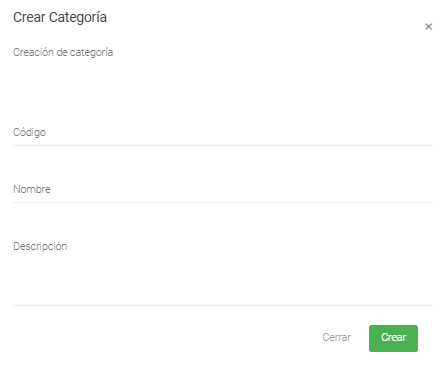

Creación de Categorías
======================================

=====================
Condiciones previas
=====================

* Estar logeado como usuario en el sistema.
* Ingresar al modulo de Productos y luego Listar Categorías: **/Productos/Listar Categorías/**

.. image:: images/menu_productos.PNG
    :align: center

=================
Iniciar Creación
=================

1. Dentro del modulo Categorías, en la parte superior derecha se encuentran tres (3) botones.
Al presionar el botón verde, abre el formulario de creación.

2. Se abre un modal con el formulario para la creación de la Categoría:

	* El primer campo, es el código el cual deberá ser único.
	
	* El segundo campo, corresponde al nombre que representa la Categoría.

	* El tercer campo, es a descripción y explica el contenido de la Categoría o su significado.

	* Existen dos botones en la parte inferior del modal: 
	
		* **Cerrar:** Cierra el modal de creación.
		
		* **Crear:** Guarda la nueva Categoría en base de datos.

3. Una vez diligenciado el formulario y al presionar el botón "Crear", deberá aparecer un cuadro de éxito:

4. Posteriormente, una vez creada la Categoría, se podrá utilizar en la creación de productos.