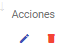
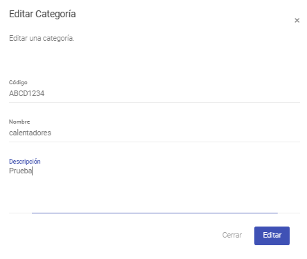
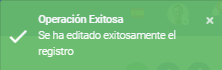

Edición de Categorías
======================================

Para poder editar una Categoría ya creada, es necesario listarlas visualizar el registro que se quiere editar. La última columna a la derecha contiene las acciones disponibles para ese registro:

Para editar presionar sobre el ícono "lápiz" y posteriormente se abrirá el siguiente formulario:

Una vez actualizada la información, se presiona sobre el botón "Editar" y posteriormente deberá salir un mensaje en la parte inferior derecha de la pantalla como se muestra a continuación:

