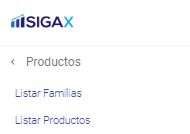
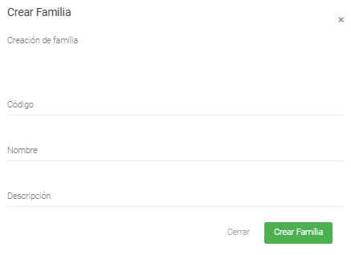

Creación de Familias
======================================

=====================
Condiciones previas
=====================

* Estar logeado como usuario en el sistema.
* Ingresar al modulo de Productos y luego Listar Familias: **/Productos/Listar Familias/**

=================
Iniciar Creación
=================

1. Dentro del modulo Familias, en la parte superior derecha se encuentran tres (3) botones.
Al presionar el botón verde, abre el formulario de creación.

.. image:: images/plus.png
    :align: center

2. Se abre un modal con el formulario para la creación de la familia:

	* El primer campo, es el código el cual deberá ser único.
	
	* El segundo campo, corresponde al nombre que representa la Familia.

	* El tercer campo, es a descripción y explica el contenido de la Familia o su significado.

	* Existen dos botones en la parte inferior del modal: 
	
		* **Cerrar:** Cierra el modal de creación.
		
		* **Crear Familia:** Guarda la nueva Familia en base de datos.

3. Una vez diligenciado el formulario y al presionar el botón "Crear Familia", deberá aparecer un cuadro de éxito:

4. Posteriormente, una vez creada la Familia, se podrá utilizar en la creación de productos.