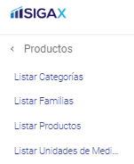

Consulta de Unidades de Medida
======================================

Para la consulta de las Unidades de Medida de productos, basta con ingresar al modulo de Productos y posteriormente a Listar Unidades de Medida: **/Productos/Listar Unidades de Medida/**

Una vez se ingresa, el Sistema automáticamente consultará las Unidades de Medida disponibles en Base de Datos.
Sobre cada una aparecerá la siguiente información:

* Nombre
* Abreviatura
* Acción Editar
* Acción Eliminar

