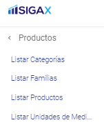
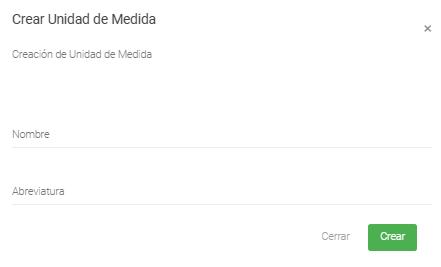

Creación de Unidades de Medida
======================================

=====================
Condiciones previas
=====================

* Estar logeado como usuario en el sistema.
* Ingresar al modulo de Productos y luego Listar Unidades de Medida: **/Productos/Listar Unidades de Medida/**

=================
Iniciar Creación
=================

1. Dentro del modulo Unidades de Medida, en la parte superior derecha se encuentran tres (3) botones.
Al presionar el botón verde, abre el formulario de creación.

.. image:: images/plus.png
    :align: center

2. Se abre un modal con el formulario para la creación de la Unidad de Medida:

	* El primer campo, corresponde al nombre que representa la Unidad de Medida.

	* El segundo campo, es la abreviatura que identificará ésta Unidad de Medida.

	* Existen dos botones en la parte inferior del modal: 
	
		* **Cerrar:** Cierra el modal de creación.
		
		* **Crear:** Guarda la nueva Unidad de Medida en base de datos.

3. Una vez diligenciado el formulario y al presionar el botón "Crear", deberá aparecer un cuadro de éxito:

4. Posteriormente, una vez creada la Unidad de Medida, se podrá utilizar en la creación de productos.