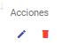

Eliminación de Unidades de Medida
======================================

Para poder eliminar una Unidad de Medida ya creada, es necesario listarlas y visualizar el registro que se quiere eliminar. La última columna a la derecha contiene las acciones disponibles para ese registro:

Para eliminar, presionar sobre el ícono "papelera" y posteriormente se mostrará una pregunta como la siguiente:

Al aprobar, deberá salir un mensaje en la parte inferior derecha de la pantalla de éxito como el siguiente:

