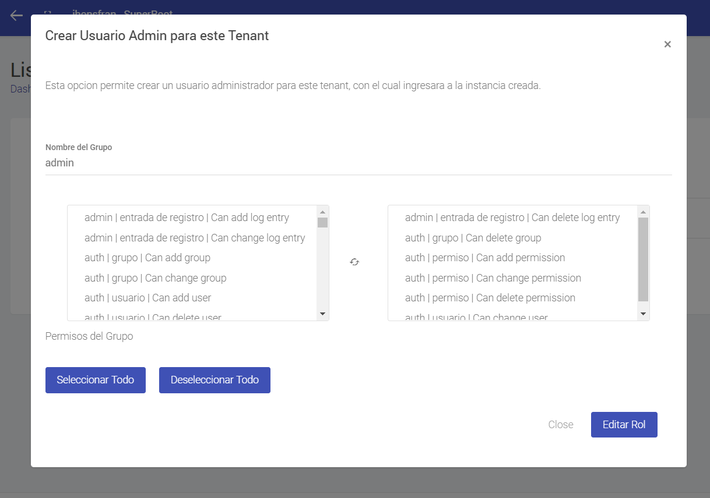
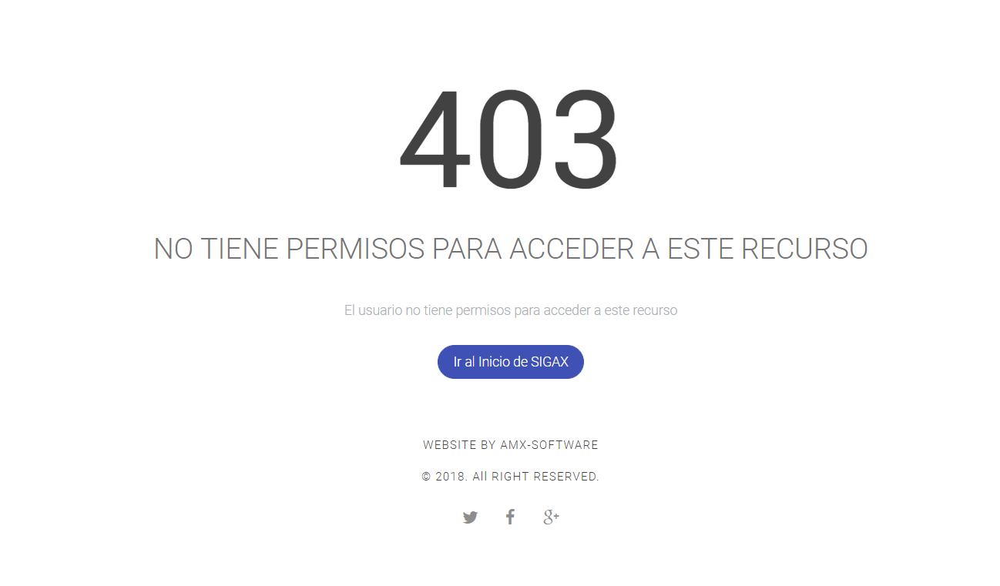
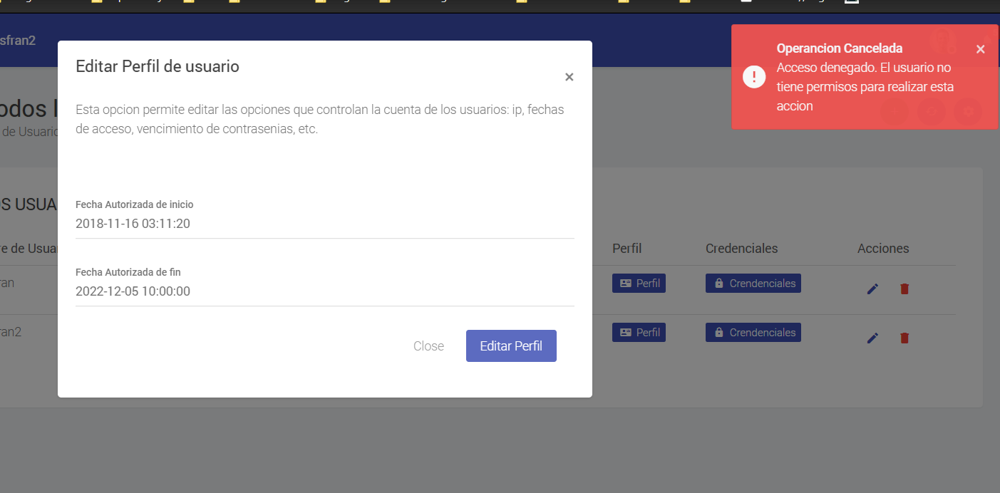

.. Este documento posee todos los commandos importantes que se deben utilizar à la hora de documenta
.. Por favor mirarlos y añadir los que utilicen y sean importantes y que no esten aquí.

.. El sistema permite la creación de grupos de usuarios, esto hará que los usuarios con dichos grupos tengan permisos a distintas funciones o modulos dentro de la aplicación.

Creación de Permisos
======================================

El sistema no permite la creación de permisos de forma dinámica, es decir, no se pueden crear permisos desde la aplicación. Los permisos se crear desde el código y son pre definidos por el programador. No existe como tal una app que cree permisos.

=====================
Condiciones previas
=====================

* EEstar logeado en el sistema
* Tener un grupo al cual se le hayan asignado permisos
* Los menus deben tener asignado los mismo grupos de los usuarios

======================================
Creación de grupos desde los modelos
======================================

Para crear un nuevo permiso sólo es necesario un par de lineas de código y ejecutar nuevamente las migraciones en la aplicación.

.. literalinclude:: ../../../app/usuarios/models.py
   :language: python
   :linenos:
   :lines: 50 - 56	
   :emphasize-lines: 0 - 6

======================================
Asignación de permisos
======================================

Existen varias posibilidades para manejar los permisos en la aplicación. El primero y más natural es la agrupación de permisos en un grupo. Estos grupos son usados para asignar una serie de permisos a diferentes menus y usuarios de la aplicación.

.. note::
   Los usuarios que tienen superuser true no necesitan tener configurado grupos o permisos. Puesto que la opción superuser asigna todos los permisos sobre la aplicación. Por eso se debe tener muy en cuenta cuando se crea un usuario.

Para asignar los permisos utilizamos la interzas de grupos que se encuentra en la url **/usuarios/listar_grupos/**

En esta interfaz se listan todos los permisos que tienen asociados los modelos y con base a la configuración que se le quiera dar a los grupos, se asignan permisos de edición, creación, eliminación o vista.

======================================
Validación de permisos
======================================

Un punto muy importante en la configuración de permisos de la aplicación es la forma en que estos se validan. Para no utilizar decoradores en las vistas, hemos utilizado un middleware que simplifica la tarea de verificación y lo hace de una forma práctica. Recordemos que los permisos se asignan sobre las url's de cada aplicación, por lo que en el archivos url's de cada app de sigax podemos encontra la siguiente estructura.

.. literalinclude:: ../../../app/usuarios/urls.py
   :language: python
   :linenos:
   :emphasize-lines: 20 - 35

Como se puede ver en la parte sobreada del código. Existe una variable que se llama **RESTRICTED_URLS** y es una variable a la cual se le anexan tupla de la siguiente manera:

:url que se desea proteger: permisos requeridos para la url

.. warning:: Las url's se deben proteger en su totalidad porque de eso depende la seguridad del sistema. Precisamente esta configuración se realiza en el archivo url's para que podamos saber cuales son las urls importantes de esa app en específico.

======================================
Cómo trabaja el middleware
======================================

La variable que creamos **RESTRICTED_URLS** es sólo una lista de tuplas que utiliza el middleware permisionrequire de la configuración global de sigax.

.. literalinclude:: ../../../app/sigax/middleware.py
   :language: python
   :linenos:
   :lines: 63 - 144	
   :emphasize-lines: 20 - 30, 42 - 45

Este es el código que valida los permisos de cada aplicación. Como se puede ver en la parte sombreada, se validan tanto las solicitudes POST como GET y se redireccionan las solicitudes sin permisos a los mensajes correspondientes. Es vital que todos los programadores del proyecto entiendad cómo funciona la validación de permisos así que los invito a que consulten más a fondo.

Otro archivo importante para la validación de los permisos es el LoginPermissionsRequired.py de la carpeta de configuración del proyecto. A continuacion se incluye y luego se explica brevemente.

.. literalinclude:: ../../../app/sigax/LoginPermissionsRequired.py
   :language: python
   :linenos:

Este último declara las variables que usa el middleware y es donde se excluyen de las validaciones urls como el login o el cambio de contraseña. En este punto el lector ya debe tener una idea de cómo funciona el middleware por lo que no me detendre en los detalles.

======================================
Templates
======================================

Los mensajes que le aparecen a un usuario que no tiene los permisos adecuados para acceder a un módulo o a una funcionalidad, permiten que la experiencia de usuario, que es tan importante para nosotros nunca sea negativa.

Template a donde se redireccionan las solicitudes cuando no se tienen permisos sobre una url

Mensaje de error cuando no se tienen permisos sobre una url y se envía un POST

.. warning:: Se debe tener en cuenta que la asignación de permisos va de la mano de la asignación de menus a los grupos de permisos. Esa es la forma que tenemos de controlar los módulos que puede ver un usuario y los permisos que tiene sobre ese módulo.