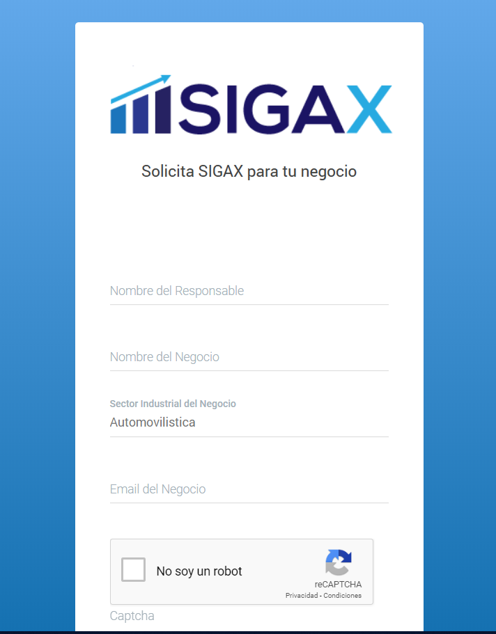
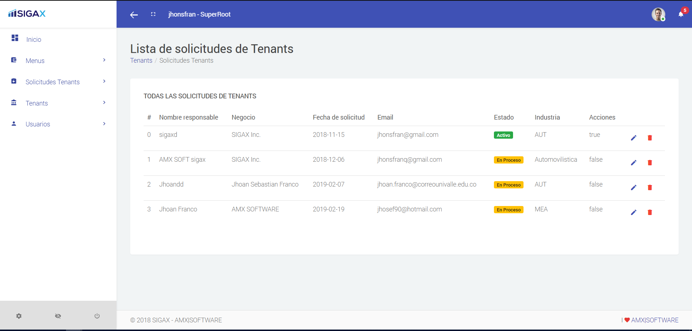

Creación de Solicitudes de Tenant
======================================

Las solicitudes de Tenant son entendidas como las solicitudes que tienen los clientes para ser parte de SIGAX. Estas Solicitudes sólo se realizan cuando un cliente tiene una necesidad específica, y ninguna de nuestras suscripciones soluciona sus problemas.

=====================
Condiciones previas
=====================

* No tiene que estar logeado en el sistema para realizar la solicitud de un Tenant. Sólo debe ingresar a la url y llenar el formualrio: **/solicitud_tenants/crear_solicitud/**

======================================
Creación de Solicitud
======================================

Para crear una solicitud sólo debe ingresar a la url proporcionada arriba.

En esta parte sólo se piden los datos básicos de usuario para poder iniciar el proceso de solicitud personalizada del tenant.

.. note:: Se debe tener en cuenta que al realizar la solicitud se envían notificaciones tanto al correo del cliente que solicita el Tenant como al correo de la empresa.

======================================
Aprobar Solicitud
======================================

Una vez realizada la solicitud, el usuario root de la aplicaci+on SIGA podrá ingresar al panel que lista todas las solicitudes y aprobarlas o rechazarlas.

.. note::
    Como se mencionó antes, todas las acciones realizadas sobre la solicitud disparan correos al cliente para que conozca cómo va su proceso de solicitud

Para alterar el estado de las solicitudes deberá ingresar a la url **/solicitud_tenants/listar_solicitudes/**

Cuando una solicitud es aprobada, automáticamente se envía una notificación al cliente donde se le informa que la solicitud ha sido aprobado. En este momento la solicitud se habilita para que se pueda crear el Tenant.

======================================
Eliminar Solicitud
======================================

Desde el panel donde se listan todas las solicitudes, es posible eliminarlas desde el botón trash.

.. warning:: Para que una solicitud sea eliminada sin problemas, esta no debe estar asociada a ningún tenant.

